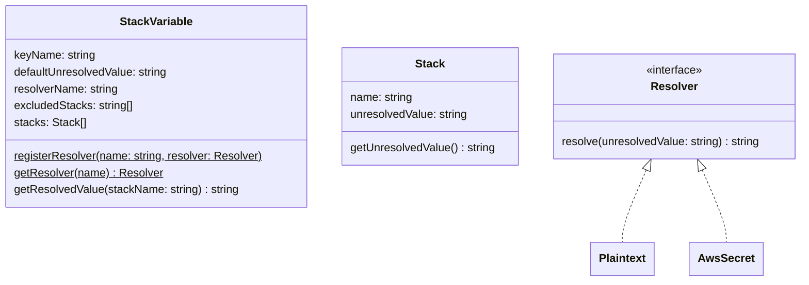

# Architecture & Design

## Architecture

### Command Line Tool

- default arch is linux/amd64, can be cross-compiled
- standard library code only
- silent output unless there's an error
- standard error is only used for errors
- standard output is only used when the verbose flag is set

### YAML Configuration File

#### Schema

```yaml
stackVariables:
  - keyName: string
    defaultUnresolvedValue: string
    resolverName: string
    excludedStacks:
      - string
    stacks:
      - name: string
        unresolvedValue: string
```

#### Example

```yaml
stackVariables:
  - keyName: API_KEY
    defaultUnresolvedValue: "arn:aws:secretsmanager:region:qa:api-key"
    resolverName: AwsSecret
    excludedStacks:
      - development
    stacks:
      - name: staging
        unresolvedValue: "arn:aws:secretsmanager:region:staging:api-key"
      - name: production
        unresolvedValue: "arn:aws:secretsmanager:region:production:api-key"

  - keyName: DATABASE_URL
    resolverName: Plaintext
    stacks:
      - name: development
        unresolvedValue: "localhost:5532"
      - name: qa1
        unresolvedValue: "qa1-db:5432"
      - name: qa2
        unresolvedValue: "qa2-db:5432"
      - name: staging
        unresolvedValue: "staging-db:5432"
      - name: production
        unresolvedValue: "prod-db:5432"

  - keyName: LOG_LEVEL
    defaultUnresolvedValue: "INFO"
    resolverName: Plaintext
```

## Design

- cross-compiled command line tool
- output is a dotenv formatted file
  - **NEVER committed**
  - key, value pairs
  - values are resolved, plaintext strings
- uses a YAML configuration file to generate the dotenv file's key, value pairs
  - should be committed
  - plaintext values (non-secrets)
  - encrypted values (secrets)
  - defaults
  - exclusions

### Classes



#### StackVariable

- At a minimum a `defaultUnresolvedValue` or a `stacks` element must be defined
- Defining both a `defaultUnresolvedValue` and one or more `stacks` elements is allowed
- The `defaultUnresolvedValue` can be plaintext or an encrypted string, related to the `resolverName`
- The `getResolvedValue()` method uses a `Resolver` to return the actual value
- Values are always resolved via their stack name:
  - If `stacks` does not have a matching `Stack.name` then the `defaultUnresolvedValue` is resolved
  - The special value "N/A" is resolved if `excludedStacks` contains the stack name
  - An error is thrown if there's no match and no `defaultUnresolvedValue`

#### Stack

- The `name` property is the name of the stack (qa1, qa2, staging, production)
- The `unresolvedValue` can be plaintext or an encrypted string, related to the parent `StackVariable.resolverName`
