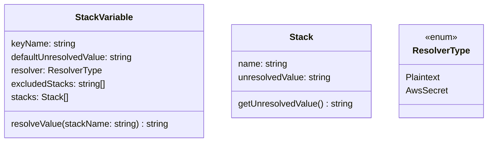

# Architecture & Design

## Design

- cross-compiled command line app
- output is a dotenv formatted file
  - **NEVER committed**
  - key, value pairs
  - values are resolved, plaintext strings
- uses a YAML configuration file to generate the dotenv file's key, value pairs
  - should be committed
  - plaintext values (non-secrets)
  - encrypted values (secrets)
  - defaults
  - exclusions

### Classes

#### StackVariable

- At a minimum a `defaultUnresolvedValue` or a `stacks` element must be defined
- Defining both a `defaultUnresolvedValue` and one or more `stacks` elements is allowed
- The `defaultUnresolvedValue` can be plaintext or an encrypted string, aligned with the `resolver`
- The `resolveValue()` method uses a `resolver` to return the actual value
- Values are always resolved via their `keyName` and stack name:
  - If there is not a matching `Stack.name` then the `defaultUnresolvedValue` is resolved
  - The special value "N/A" is resolved if `excludedStacks` contains the stack name
  - An error is thrown if there's no match and no `defaultUnresolvedValue`

#### Stack

- The `name` property is the name of the stack (qa1, qa2, staging, production)
- The `unresolvedValue` can be plaintext or an encrypted string, aligned with the parent `StackVariable.resolver`
